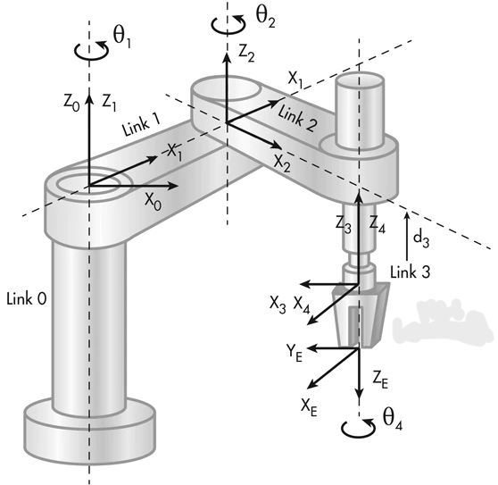
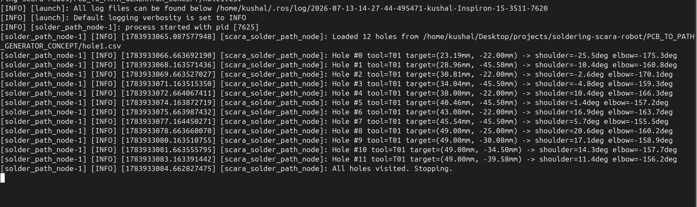

# PCB-To-Path-Generator

This repository currently contains the Proof of Concept for the PCB To Path Generator Software (PPG) and its demonstrating automatic extraction of (X,Y) coordinates for the SCARA Robot from a .drl file providede by the user. 

The main purpose of the software is to automate or significantly reduce the time consumed by manual programming of soldering systems. 
// Setup

To run this on your computer you would need a Ubuntu 24 OS, and the instructions are for Ubuntu 24 as we are using ROS2 Jazzy

S1) Download the entire zip file and seperate the PCB_TO_PATH_GENERATOR and the ROS2 scara_sim workspace
S2) Open terminal in the PCB_TO_PATH_GENERATOR and then run the following command

      python3 excellon_parser.py test-PTH.drl -o hole2.csv

S3) You will get a file named hole2.csv which would contain the X,Y Coordinates of the holes in the PCB.
S4) Now open scara_test_ros2_ws and run

    colcon build

S5) Add /scara_test_ros2_ws/install/setup.bash into the .bashrc file and run source .bashrc
S6) Run the following command 

    ros2 launch scara_solder_sim solder_sim.launch.py csv_path:=/home/kushal/Desktop/projects/soldering-scara-robot/PCB_TO_PATH_GENERATOR_CONCEPT/hole1.csv

Output:

    

// Working

PPG uses an PTH (Plated Through Hole) .drl file provided by the user. The PTH file contains decimal values for the location of the holes in the PCB, PTH files are mainly developed for PCB Drilling Machines as they use these locations to drill holes.

An PTH(Plated Through Hole) File contains 3 main information for an CNC Machine:

1) Drilling Tool Size
2) X,Y Coordinates of the centre of the holes
3) Diameter of the hole

Out of these 3 information we only use 2 for our SCARA Robot, namely X,Y Coordinates and Diameter.

// From X,Y To Robot X,Y

After getting the .csv file with the X,Y Coordinates and Diameter of the holes, now we convert these coordinates into SCARA Robots Coordinate System. 

We use 3 variables namely:

1) θ : The angle by which the whole board is twisted
2) tx : How far the PCB's own origin point (0,0 in your CSV) sits from the robot's origin point, measured along the robot's X axis.
3) ty : How far the PCB's own origin point (0,0 in your CSV) sits from the robot's origin point, measured along the robot's Y axis.

Then we apply this into formulas: 

    X = x·cos(θ) − y·sin(θ) + tx
    Y = x·sin(θ) + y·cos(θ) + ty

Here, X = Location of the hole for the X Axis of the SCARA Robot
      Y = Location of the hole for the Y Axis of the SCARA Robot

Now we can directly use these formulas to find the coordinates if the θ is 0, which is not possible in real life.

So we use fiducial markers to the find the real values of θ, tx and ty. There are 4 steps which we follow to find these 3 values:

S1) Find the position or touch the soldering iron to the fiducial markers made on the PCB. This would give us a value in X,Y coordinates of the robot. 

S2) We complete this process of touching the soldering iron either automatically or manually to all the Fiducial Markers.

S3) We use these formulas to extract or retract the values:

    a) θ = angle_of_AB_in_robot_space − angle_of_AB_in_PCB_space
    b) tx = A_robot_X − (A_pcb_x·cosθ − A_pcb_y·sinθ)
    c) ty = A_robot_Y − (A_pcb_x·sinθ + A_pcb_y·cosθ)

S4) After finding these values we use them on each of there respective holes using these formulas to find there X,Y Position

    X = x·cos(θ) − y·sin(θ) + tx
    Y = x·sin(θ) + y·cos(θ) + ty

// Aruco Markers

For PCBs without Fiducial Markers we can use things like Aruco Markers Placed over the PCB, which we have to work and think about and is not complete yet.

// Complete Product

As this is only the Proof of Concept for the PPG ,the final PPG software would contain a proper GUI, Ability to Define Priority, Assign Components to Each hole, Temperature Requirement(if possible), etc. 

